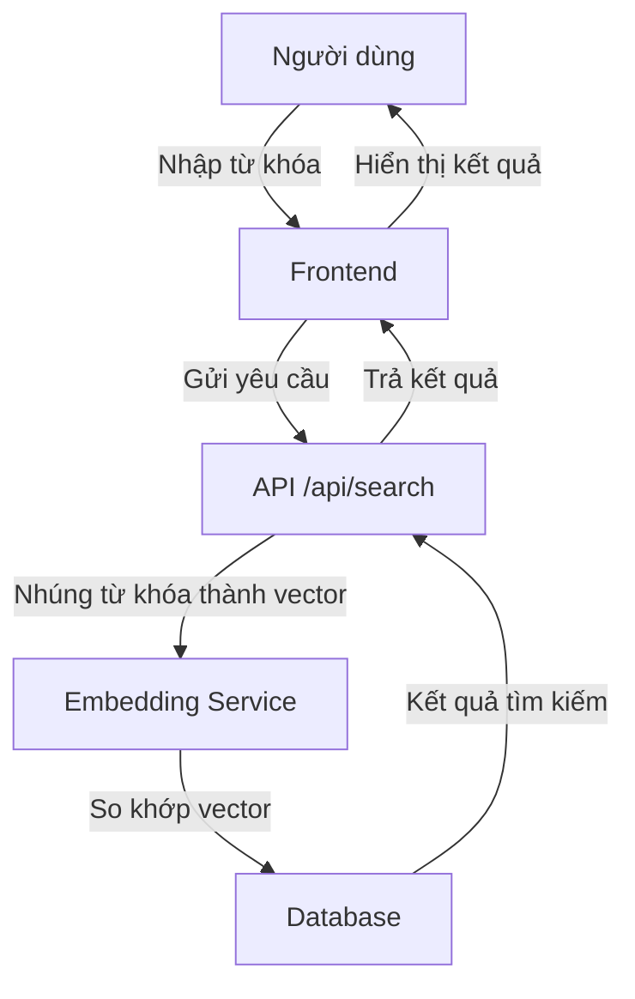

## 3.2.2. Sơ đồ kiến trúc tổng thể và các thành phần

Sơ đồ kiến trúc tổng thể mô tả các thành phần chính của hệ thống và cách chúng tương tác với nhau. Các thành phần chính bao gồm:

- **Frontend**: Giao diện người dùng được xây dựng bằng Next.js.
- **Backend**: API được triển khai trên Next.js App Router, xử lý logic nghiệp vụ và giao tiếp với cơ sở dữ liệu.
- **Database**: Supabase được sử dụng để lưu trữ dữ liệu, với các chính sách RLS đảm bảo bảo mật.
- **LLM Integration**: Tích hợp mô hình ngôn ngữ lớn (GROQ) để tóm tắt và phân tích văn bản.
- **State Management**: Zustand được sử dụng để quản lý trạng thái ứng dụng phía client.

```mermaid
graph TD
    A[Frontend (Next.js)] -->|API Requests| B[Backend (Next.js App Router)]
    B -->|Database Queries| C[Database (Supabase)]
    B -->|LLM Requests| D[LLM Integration (GROQ)]
    A -->|State Updates| E[State Management (Zustand)]
    C -->|RLS Policies| C
    D -->|Summarization Results| B
```

*Hình 3.2.2: Sơ đồ kiến trúc tổng thể*

---

## 3.2.3. Mô tả luồng dữ liệu của các chức năng tiêu biểu

### Chức năng 1: Tóm tắt văn bản
```mermaid
graph TD
    A[Người dùng] -->|Nhập văn bản/URL| B[Frontend]
    B -->|Gửi yêu cầu| C[API /api/summarize]
    C -->|Gọi GROQ| D[LLM (GROQ)]
    D -->|Kết quả tóm tắt| C
    C -->|Lưu vào cơ sở dữ liệu| E[Database]
    C -->|Trả kết quả| B
    B -->|Hiển thị kết quả| A
```

### Chức năng 2: Tìm kiếm ghi chú


### Chức năng 3: Phân loại thông minh
```mermaid
graph TD
    A[Người dùng] -->|Tạo/Cập nhật ghi chú| B[Frontend]
    B -->|Gửi yêu cầu| C[API /api/notes]
    C -->|Kích hoạt trigger phân loại| D[Backend]
    D -->|Kiểm tra quy tắc phân loại| E[Database (smart_folders)]
    E -->|Gán thư mục phù hợp| F[Database (smart_folder_assignments)]
    F -->|Cập nhật kết quả| C
    C -->|Trả kết quả| B
    B -->|Hiển thị kết quả| A
```

### Chức năng 4: Liên kết ghi chú
```mermaid
graph TD
    A[Người dùng] -->|Tạo ghi chú mới| B[Frontend]
    B -->|Gửi yêu cầu| C[API /api/notes]
    C -->|Kích hoạt tự động liên kết| D[Backend]
    D -->|Tìm ghi chú tương tự| E[Database (notes)]
    E -->|Tạo liên kết| F[Database (note_links)]
    F -->|Cập nhật liên kết| C
    C -->|Trả kết quả| B
    B -->|Hiển thị liên kết| A
```

## 3.4. Thiết kế cơ sở dữ liệu (Database Design)

### 3.4.1. Sơ đồ quan hệ thực thể (ERD)

Sơ đồ quan hệ thực thể (ERD) mô tả các thực thể chính trong hệ thống và mối quan hệ giữa chúng. Dưới đây là các thực thể chính:

- **Users**: Lưu thông tin người dùng.
- **Notes**: Lưu trữ ghi chú của người dùng.
- **Tags**: Quản lý các thẻ liên quan đến ghi chú.
- **Workspaces**: Tổ chức các ghi chú theo không gian làm việc.
- **Smart Folders**: Tự động phân loại ghi chú dựa trên quy tắc.
- **Note Links**: Liên kết hai ghi chú có liên quan.

  
*Hình 3.4.1: Sơ đồ quan hệ thực thể (ERD)*

### 3.4.2. Thiết kế chi tiết các bảng (Schema)

#### Bảng `users`
```sql
CREATE TABLE users (
  id UUID PRIMARY KEY,
  email TEXT NOT NULL UNIQUE,
  password_hash TEXT NOT NULL,
  created_at TIMESTAMPTZ DEFAULT NOW()
);
```

#### Bảng `notes`
```sql
CREATE TABLE notes (
  id BIGSERIAL PRIMARY KEY,
  user_id UUID REFERENCES users(id) ON DELETE CASCADE,
  workspace_id UUID REFERENCES workspaces(id) ON DELETE CASCADE,
  summary TEXT,
  original_notes TEXT,
  sentiment TEXT,
  is_public BOOLEAN DEFAULT FALSE,
  share_id UUID,
  created_at TIMESTAMPTZ DEFAULT NOW()
);
```

#### Bảng `tags`
```sql
CREATE TABLE tags (
  id BIGSERIAL PRIMARY KEY,
  name TEXT NOT NULL,
  user_id UUID REFERENCES users(id) ON DELETE CASCADE,
  created_at TIMESTAMPTZ DEFAULT NOW()
);
```

#### Bảng `workspaces`
```sql
CREATE TABLE workspaces (
  id UUID PRIMARY KEY,
  name TEXT NOT NULL,
  created_at TIMESTAMPTZ DEFAULT NOW()
);
```

#### Bảng `smart_folders`
```sql
CREATE TABLE smart_folders (
  id BIGSERIAL PRIMARY KEY,
  user_id UUID REFERENCES users(id) ON DELETE CASCADE,
  workspace_id UUID REFERENCES workspaces(id) ON DELETE CASCADE,
  name TEXT NOT NULL,
  rules JSONB NOT NULL,
  created_at TIMESTAMPTZ DEFAULT NOW()
);
```

#### Bảng `note_links`
```sql
CREATE TABLE note_links (
  id BIGSERIAL PRIMARY KEY,
  source_note_id BIGINT REFERENCES notes(id) ON DELETE CASCADE,
  target_note_id BIGINT REFERENCES notes(id) ON DELETE CASCADE,
  user_id UUID REFERENCES users(id) ON DELETE CASCADE,
  similarity_score DECIMAL(5,4),
  created_at TIMESTAMPTZ DEFAULT NOW()
);
```